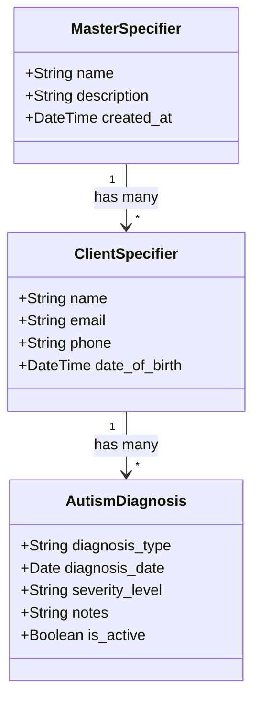

### MD FILES CODE SNIPPET
'hello this is nicky' 
---------- 

###### to insert image


###### Link to another web page
[title](https://www.example.com)

###### Code section

'
print("hello this is nicky how you doing mate")

'

#### HACK SECTION 😎
> to use <ins>will be underlined</ins> 
> we can also <center>center this word</center>
> we can also change the text color <font color="red">This text is red</font>
> :warning: **Warning:** Do not push this button this is warning section
> :smile:  

> we can run 'python manage.py check ': to see wether our code have syntax error or not


**14/07/26** THURSDAY
- FINISH DATA MODEL BETWEEN CLIENT AND DIAGNOSIS ENTITY

**CURRENT PROGRESS**
- CLIENT(username(PK), child_name, parent_name, )

# learning lesson
- what is SET_NULL
so for example we have,

this two models

which is for example 

class Author(models.Model):
    name = models.CharField(max_length=100)

class Book(models.Model):
    title = models.CharField(max_length=200)
    author = models.ForeignKey(
          Author,
          on_delete=models.SET_NULL,
          null=True,
          blank=True,
)

~ so what happen here actually is, just that if we delete author the book detail will not delete but just make our author fields blank


> what we already did ? 
- creating unified model User from AbstractUser
> so what is the benefit of it ? 
: we can inherit the basic attributes of User
```python

id
password
last_login
is_superuser
username (special, unique constraint)
first_name
last_name
email
is_staff
is_active
date_joined

> by default we have all of this attributes we will inherit if we declare our models like this 

```python 
class User(AbstractUser):
#here we actually can have our own custom fields 

```

``` 

> this will ensure that we follow the rules of DRY Dont Repeat Yourself
```

- next we have create @property to check the property easier to manage who can access certain views

- 

> so where do we wanna start ?

- setup the authentication first and then we can edit the views make them go to the dashboard that we want

- nope we gotta add the detail of client autism specification 

about what they actually face, what are their prescription

- client models add fields
*MasterSpecifier*: 
*ClientSpecifier*: 
*AutismDiagnosis*: 




**BUSINESS RULES**
> Dr. roles to approve the the client specifier
> Therapist propose the client autism specifier
> master specifier are created by Dr. follow the DSM documentation
> Autism diagnosis 


*LIST OF ENTITY*
> AUTISM_DIAGNOSIS (autism_diagnosis_id(pk), client_id(fk), diagnosed_by(fk), support_level, diagnosis_date, is_active, clinical_notes, created_at, updated_at)
#### so after we have set the diagnosis 
#### we need to have the specifier
~ one client can have many active autism diagnosis [USER -> AUTISM_DIAGNOSIS]
~ one doctor can diagnose many clients [USER -> AUTISM_DIAGNOSIS]
~ one specifier can be assigned to many clients [MASTER_SPECIFIER -> CLIENT_SPECIFIER]
~ one doctor can state many specifiers
~ one therapist can propose many specifiers
~ one doctor can approve many specifiers

## PURPOSE OF EACH ENTITY
#| # | ENTITY | PURPOSE |
| --------------- | --------------- | --------------- |
| 1.1 | USER | unified user model such as (admin, therapist, doctor,      client) |
| 1.2 | AUTISM_DIAGNOSIS | stores the autism diagnosis for the client |
| 1.3 | MASTER_SPECIFIER | Master list of all possible DSM 5 specifiers |
| 1.4 | CLIENT_SPECIFIER | Bridge table linking clients to specifiers |


### full story 
> **STEP1* THE CLIENT IS REGISTERED: Alex Johnson, a 9 year old boy registered by admin
> **STEP 2: DOCTOR DIAGNOSES ALEX WITH AUTISM:**DR. CHEN EVALUATES ALEX AND CREATES AND AUTISM DIAGNOSIS
E.X 
autism_diagnosis_id	
client_id	
diagnosed_by	
support_level	
diagnosis_date	
is_active
==================== **the data**
101	
4 (Alex)	
3 (Dr. Chen)	
2 (Substantial Support)	
2024-01-15	
TRUE

>**STEP 3: THE DOCTOR SELECT THE SPECIFIERS:**During the evaluation, Dr. Chen assesses Alex and documents the following:

*****************************************************************

# 📄 Autism Specifiers System - Complete Documentation

## Table of Contents

1. [Overview](#overview)
2. [Entities & Attributes](#entities--attributes)
   - [1. User (Unified)](#1-user-unified)
   - [2. AutismDiagnosis](#2-autismdiagnosis)
   - [3. MasterSpecifier](#3-masterspecifier)
   - [4. ClientSpecifier](#4-clientspecifier-bridge-table)
3. [Entity Relationship Summary](#entity-relationship-summary)
4. [Business Rules](#business-rules)
   - [Category 1: Master Specifier Management](#-category-1-master-specifier-management)
   - [Category 2: Client Specifier Documentation](#-category-2-client-specifier-documentation)
   - [Category 3: Approval Workflow](#-category-3-approval-workflow)
   - [Category 4: Data Integrity](#-category-4-data-integrity)
5. [Case Example: Alex Johnson](#-case-example-alex-johnson)
   - [Step 1: Client Registration](#-step-1-client-registration)
   - [Step 2: Autism Diagnosis](#-step-2-autism-diagnosis)
   - [Step 3: Doctor Selects Specifiers](#-step-3-doctor-selects-specifiers)
   - [Step 4: ClientSpecifier Records Created](#-step-4-clientspecifier-records-created)
   - [Step 5: Complete Clinical Picture](#-step-5-alexs-complete-clinical-picture)
   - [Step 6: Therapist Proposes New Specifier](#-step-6-therapist-proposes-new-specifier)
   - [Step 7: Doctor Approves](#-step-7-doctor-approves)
6. [Query Examples](#-query-examples)
7. [Summary](#-summary)

---

## Overview

The **Autism Specifiers** module tracks DSM-5 specifiers for clients with Autism Spectrum Disorder. It follows the **Master + Bridge** pattern to avoid redundancy and ensure clinical accuracy.

### Key Features

- ✅ One `MasterSpecifier` table stores all possible specifiers
- ✅ `ClientSpecifier` bridge table links clients to specifiers
- ✅ Full audit trail for all changes
- ✅ **Therapists propose** → **Doctors approve** workflow
- ✅ Both "With" and "Without" required for core DSM-5 specifiers

---

## Entities & Attributes

### 1. User (Unified) using AbstractUser models inheritance

The unified user model for all roles.

| Attribute | Type | Description |
|-----------|------|-------------|
| `id` | PK | Unique identifier |
| `username` | String (Unique) | Login username |
| `password` | String (Hashed) | Secured password |
| `email` | String | Email address |
| `first_name` | String | First name |
| `last_name` | String | Last name |
| `role` | Enum | `admin`, `therapist`, `doctor`, `client` |
| `is_active` | Boolean | Soft delete flag |
| `created_at` | DateTime | Audit trail |
| `updated_at` | DateTime | Audit trail |

**Role Descriptions:**
 
| Role | Description |
|------|-------------|
| **Admin** | Manages system, users, and master data |
| **Therapist** | Works with clients, proposes specifiers |
| **Doctor** | Diagnoses clients, approves specifiers |
| **Client** | The patient/person receiving services |

---

### 2. AutismDiagnosis

Stores the autism diagnosis for a client.

| Attribute | Type | Description |
|-----------|------|-------------|
| `autism_diagnosis_id` | PK | Unique identifier |
| `client_id` | FK → User | The client with this diagnosis |
| `diagnosed_by` | FK → User | The doctor who diagnosed |
| `support_level` | Integer (1, 2, 3) | DSM-5 support level |
| `diagnosis_date` | Date | Date of diagnosis |
| `is_active` | Boolean | Is this the active diagnosis? |
| `clinical_notes` | Text | Additional notes |
| `created_at` | DateTime | Audit trail |
| `updated_at` | DateTime | Audit trail |

**Support Levels:**

| Level | Description |
|-------|-------------|
| **1** | Requiring Support |
| **2** | Requiring Substantial Support |
| **3** | Requiring Very Substantial Support |

---

### 3. MasterSpecifier

The "menu" of all possible DSM-5 specifiers.

| Attribute | Type | Description |
|-----------|------|-------------|
| `specifier_id` | PK | Unique identifier |
| `specifier_name` | String (Unique) | Name of the specifier |
| `specifier_category` | String | Category (Language, Intellectual, etc.) |
| `is_positive_specifier` | Boolean | TRUE = "With", FALSE = "Without" |
| `dsm_code` | String | DSM-5 reference code |
| `is_required` | Boolean | Is this required to document? |
| `is_active` | Boolean | Soft delete flag |
| `created_at` | DateTime | Audit trail |
| `updated_at` | DateTime | Audit trail |

**Sample MasterSpecifier Data:**

| specifier_id | specifier_name | specifier_category | is_positive_specifier | is_required |
|--------------|----------------|-------------------|----------------------|-------------|
| 1 | With language impairment | Language | TRUE | TRUE |
| 2 | Without language impairment | Language | FALSE | TRUE |
| 3 | With intellectual impairment | Intellectual | TRUE | TRUE |
| 4 | Without intellectual impairment | Intellectual | FALSE | TRUE |
| 5 | With catatonia | Medical | TRUE | TRUE |
| 6 | Without catatonia | Medical | FALSE | TRUE |
| 7 | With regression | Developmental | TRUE | TRUE |
| 8 | Without regression | Developmental | FALSE | TRUE |
| 9 | With pica | Behavioral | TRUE | TRUE |
| 10 | Without pica | Behavioral | FALSE | TRUE |
| 11 | With sleep disturbance | Medical | TRUE | FALSE |
| 12 | With sensory seeking behavior | Sensory | TRUE | FALSE |

---

### 4. ClientSpecifier (Bridge Table)

Links a client's autism diagnosis to specific specifiers.

| Attribute | Type | Description |
|-----------|------|-------------|
| `client_specifier_id` | PK | Unique identifier |
| `autism_diagnosis_id` | FK → AutismDiagnosis | Which diagnosis |
| `specifier_id` | FK → MasterSpecifier | Which specifier |
| `severity` | Enum | `mild`, `moderate`, `severe`, `n/a` |
| `is_present` | Boolean | TRUE = HAS it, FALSE = Does NOT have it |
| `clinical_notes` | Text | Clinical description |
| `is_initial` | Boolean | TRUE = from initial evaluation |
| `stated_by` | FK → User | Who stated it (doctor) |
| `stated_date` | Date | When stated |
| `proposed_by` | FK → User | Who proposed it (therapist) |
| `approved_by` | FK → User | Who approved it (doctor) |
| `is_pending_approval` | Boolean | Waiting for approval? |
| `created_at` | DateTime | Audit trail |
| `updated_at` | DateTime | Audit trail |

---

## Entity Relationship Summary

| Relationship | Cardinality | Explanation |
|--------------|-------------|-------------|
| **User → AutismDiagnosis** (as client) | One-to-Many | One client can have one active autism diagnosis |
| **User → AutismDiagnosis** (as doctor) | One-to-Many | One doctor can diagnose many clients |
| **AutismDiagnosis → ClientSpecifier** | One-to-Many | One diagnosis can have many specifiers |
| **MasterSpecifier → ClientSpecifier** | One-to-Many | One specifier can be assigned to many clients |
| **User → ClientSpecifier** (as stated_by) | One-to-Many | One doctor can state many specifiers |
| **User → ClientSpecifier** (as proposed_by) | One-to-Many | One therapist can propose many specifiers |
| **User → ClientSpecifier** (as approved_by) | One-to-Many | One doctor can approve many specifiers |

---

## Business Rules

### 📋 Category 1: Master Specifier Management

| Rule ID | Business Rule |
|---------|---------------|
| **MS-001** | Only **Clinical Directors** and **Doctors** can add, edit, or deactivate specifiers in the `MasterSpecifier` table. |
| **MS-002** | A specifier name must be **unique**. No two specifiers can have the same name. |
| **MS-003** | Each specifier must be categorized (e.g., Language, Intellectual, Medical). |
| **MS-004** | The `is_positive_specifier` flag must be set correctly: `TRUE` = "With", `FALSE` = "Without". |
| **MS-005** | Specifiers marked as `is_required = TRUE` **cannot** be deleted or deactivated. |

---

### 📋 Category 2: Client Specifier Documentation

| Rule ID | Business Rule |
|---------|---------------|
| **CS-001** | A specifier can **only** be added to a client if they have an **active** `AutismDiagnosis`. |
| **CS-002** | For **required specifiers** (Language, Intellectual, Catatonia, Regression, Pica), the system **must** create **BOTH** the "With" and "Without" records. |
| **CS-003** | For each required specifier pair, **exactly one** must have `is_present = TRUE` and the other `is_present = FALSE`. |
| **CS-004** | For **optional specifiers**, a record is **only** created if the client has it (`is_present = TRUE`). |
| **CS-005** | If `is_present = FALSE`, the `severity` field **must** be `'N/A'` or `NULL`. |
| **CS-006** | If `is_present = TRUE`, the `severity` field **must** be one of: `'mild'`, `'moderate'`, or `'severe'`. |
| **CS-007** | A client **cannot** have duplicate specifiers. |

---max_length

### 📋 Category 3: Approval Workflow

| Rule ID | Business Rule |
|---------|---------------|
| **AW-001** | **Therapists** can **propose** new specifiers or changes to existing specifiers. |
| **AW-002** | Proposed specifiers must have `is_pending_approval = TRUE` until approved. |
| **AW-003** | **Doctors** must review and **approve** or **reject** proposed specifiers. |
| **AW-004** | When approved: `is_pending_approval = FALSE`, `approved_by` is set. |
| **AW-005** | When rejected: `is_pending_approval = FALSE`, `is_active = FALSE`. |
| **AW-006** | **Initial** specifiers do **not** require approval. |
| **AW-007** | A therapist **cannot** approve their own proposed specifier. |

---

### 📋 Category 4: Data Integrity

| Rule ID | Business Rule |
|---------|---------------|
| **DI-001** | All clinical changes must be logged in the `AuditLog`. |
| **DI-002** | A specifier record **cannot** be permanently deleted. Only soft deactivated. |
| **DI-003** | When deactivated, the `clinical_notes` field must contain the reason. |
| **DI-004** | If a client's `AutismDiagnosis` is deactivated, all associated `ClientSpecifier` records must be deactivated. |
| **DI-005** | A specifier cannot be added if the client does not have an **active** `AutismDiagnosis`. |

---

## 📋 Case Example: Alex Johnson

### 👤 Client Information

| Field | Value |
|-------|-------|
| **Name** | Alex Johnson |
| **Age** | 9 years old |
| **Diagnosis** | Autism Spectrum Disorder |
| **Support Level** | Level 2 (Requiring Substantial Support) |
| **Diagnosed By** | Dr. Chen |
| **Diagnosis Date** | 2024-01-15 |

---

### 📋 Step 1: Client Registration

Alex is registered in the system.

**User Table:**

| id | username | first_name | last_name | role |
|----|----------|------------|-----------|------|
| 1 | admin1 | Sarah | Admin | admin |
| 2 | therapist1 | Jane | Therapist | therapist |
| 3 | doctor1 | Dr. Chen | Chen | doctor |
| 4 | alex_j | Alex | Johnson | client |

---

### 📋 Step 2: Autism Diagnosis

**Dr. Chen** creates the diagnosis record.

**AutismDiagnosis Table:**

| autism_diagnosis_id | client_id | diagnosed_by | support_level | diagnosis_date | is_active |
|---------------------|-----------|--------------|---------------|----------------|-----------|
| 101 | 4 (Alex) | 3 (Dr. Chen) | 2 | 2024-01-15 | TRUE |

---

### 📋 Step 3: Doctor Selects Specifiers

**Dr. Chen** documents Alex's specifiers:

| Category | Alex HAS | Alex DOES NOT HAVE |
|----------|----------|-------------------|
| Language | ✅ With language impairment | ❌ Without language impairment |
| Intellectual | ✅ With intellectual impairment | ❌ Without intellectual impairment |
| Catatonia | ❌ With catatonia | ✅ Without catatonia |
| Regression | ❌ With regression | ✅ Without regression |
| Pica | ❌ With pica | ✅ Without pica |
| Sleep | ✅ With sleep disturbance | - (optional) |
| Sensory | ✅ With sensory seeking | - (optional) |

---

### 📋 Step 4: ClientSpecifier Records Created

| client_specifier_id | specifier_name | severity | is_present | is_initial | stated_by |
|---------------------|----------------|----------|------------|------------|-----------|
| 1 | With language impairment | moderate | TRUE | TRUE | Dr. Chen |
| 2 | Without language impairment | N/A | FALSE | TRUE | Dr. Chen |
| 3 | With intellectual impairment | mild | TRUE | TRUE | Dr. Chen |
| 4 | Without intellectual impairment | N/A | FALSE | TRUE | Dr. Chen |
| 5 | With catatonia | N/A | FALSE | TRUE | Dr. Chen |
| 6 | Without catatonia | N/A | TRUE | TRUE | Dr. Chen |
| 7 | With regression | N/A | FALSE | TRUE | Dr. Chen |
| 8 | Without regression | N/A | TRUE | TRUE | Dr. Chen |
| 9 | With pica | N/A | FALSE | TRUE | Dr. Chen |
| 10 | Without pica | N/A | TRUE | TRUE | Dr. Chen |
| 11 | With sleep disturbance | severe | TRUE | TRUE | Dr. Chen |
| 12 | With sensory seeking | moderate | TRUE | TRUE | Dr. Chen |

---

### 📋 Step 5: Alex's Complete Clinical Picture
┌─────────────────────────────────────────────────────────────────────────────┐
│ ALEX JOHNSON - CLINICAL RECORD │
├─────────────────────────────────────────────────────────────────────────────┤
│ │
│ 👤 CLIENT: Alex Johnson (age 9) │
│ 🏥 DIAGNOSIS: Autism Spectrum Disorder (Level 2) │
│ 📅 DIAGNOSED: 2024-01-15 by Dr. Chen │
│ │
│ 📋 SPECIFIERS (HAS - is_present = TRUE): │
│ ├── ✅ With language impairment (Moderate) │
│ │ └── Uses AAC device, limited verbal speech │
│ ├── ✅ With intellectual impairment (Mild) │
│ │ └── IQ 70, modified curriculum │
│ ├── ✅ Without catatonia (N/A) - RULED OUT │
│ ├── ✅ Without regression (N/A) - RULED OUT │
│ ├── ✅ Without pica (N/A) - RULED OUT │
│ ├── ✅ With sleep disturbance (Severe) │
│ │ └── Wakes 3-4 times per night │
│ └── ✅ With sensory seeking behavior (Moderate) │
│ └── Constantly spins, jumps, crashes │
│ │
│ 📋 SPECIFIERS (DOES NOT HAVE - is_present = FALSE): │
│ ├── ❌ Without language impairment (N/A) │
│ ├── ❌ Without intellectual impairment (N/A) │
│ ├── ❌ With catatonia (N/A) - RULED OUT │
│ ├── ❌ With regression (N/A) - RULED OUT │
│ └── ❌ With pica (N/A) - RULED OUT │
│ │
│ 📊 SUMMARY: │
│ ├── Total Required Specifiers: 10 (5 With, 5 Without) │
│ ├── Optional Specifiers: 2 (sleep, sensory) │
│ └── Total Records: 12 │
│ │
└─────────────────────────────────────────────────────────────────────────────┘


---

### 📋 Step 6: Therapist Proposes New Specifier

After 2 months, **Therapist Jane** observes head-banging during meltdowns and proposes a new specifier.

**Proposed Specifier:**

| Field | Value |
|-------|-------|
| **Specifier** | With self-injurious behavior |
| **Severity** | Moderate |
| **Clinical Notes** | Head-banging during meltdowns, observed 3x in 2 weeks |
| **Proposed By** | Therapist Jane |
| **Status** | `is_pending_approval = TRUE` |

---

### 📋 Step 7: Doctor Approves

**Dr. Chen** reviews and approves the proposal.

**Updated Record:**

| client_specifier_id | specifier_name | is_present | proposed_by | approved_by | is_pending_approval |
|---------------------|----------------|------------|-------------|-------------|---------------------|
| 13 | With self-injurious behavior | TRUE | Therapist Jane | Dr. Chen | FALSE |

**Alex's Updated Clinical Picture:**
┌─────────────────────────────────────────────────────────────────────────────┐
│ ALEX JOHNSON - UPDATED RECORD │
├─────────────────────────────────────────────────────────────────────────────┤
│ │
│ 📋 SPECIFIERS (HAS - is_present = TRUE): │
│ ├── ✅ With language impairment (Moderate) │
│ ├── ✅ With intellectual impairment (Mild) │
│ ├── ✅ Without catatonia (N/A) - RULED OUT │
│ ├── ✅ Without regression (N/A) - RULED OUT │
│ ├── ✅ Without pica (N/A) - RULED OUT │
│ ├── ✅ With sleep disturbance (Severe) │
│ ├── ✅ With sensory seeking behavior (Moderate) │
│ └── ✅ With self-injurious behavior (Moderate) ← NEW! APPROVED! │
│ └── Head-banging during meltdowns │
│ │
└─────────────────────────────────────────────────────────────────────────────┘
